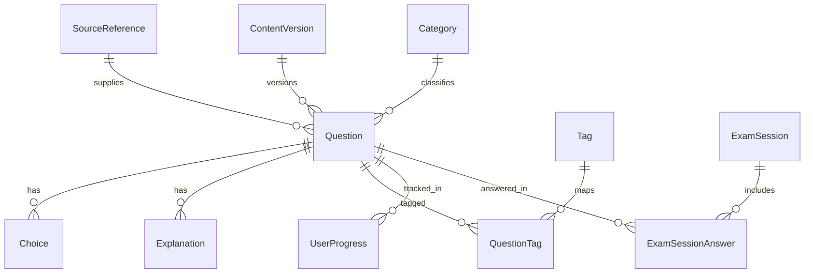

# 日本運転免許本試験 学習アプリ データスキーマ定義 v0.2

## 1. 目的

本ドキュメントは、MVP で扱う問題データの基本構造を定義する。

現行運用では `レビュー専用レコード` は持たず、問題の表示可否は `Question.status` のみで管理する。

## 2. 設計方針

- `参照元` `問題` `選択肢` `解説` `学習履歴` は分離する
- Learner 向け画面に表示するかどうかは `Question.status` で決める
- `published` が公開、`unpublished` が非公開
- 新規追加問題の初期値は `published`
- 問題画像や標識画像は、必ず `sourceReferenceId` または `sourceReference` と辿れる状態を保つ
- 学習履歴はコンテンツ本体から独立して保持する

## 3. 全体構造

## 4. エンティティ一覧

| Entity | 役割 | MVP必須 |
| --- | --- | --- |
| `SourceReference` | 問題や画像の参照元、取得情報、補足メモを持つ | Yes |
| `ContentVersion` | 公開版のまとまりを管理する | Yes |
| `Category` | 主要カテゴリを管理する | Yes |
| `Tag` | 補助タグを管理する | Yes |
| `Question` | 出題単位。公開/非公開状態を持つ | Yes |
| `Choice` | 問題の選択肢 | Yes |
| `Explanation` | 問題に紐づく英語解説 | Yes |
| `QuestionTag` | 問題とタグの関連付け | Yes |
| `UserProgress` | 問題単位の学習集計 | Yes |
| `ExamSession` | 模試・演習セッションのまとまり | Yes |
| `ExamSessionAnswer` | セッション内の各解答履歴 | Yes |
| `GlossaryTerm` | 用語集・標識集の表示用データ | Yes |

## 5. 詳細定義

### 5.1 `SourceReference`

| Field | Type | Required | Notes |
| --- | --- | --- | --- |
| `id` | string | Yes | 例: `src_001` |
| `sourceName` | string | Yes | 参照元名 |
| `sourceType` | enum | Yes | `official_site`, `official_pdf`, `official_booklet`, `other` |
| `sourceUrl` | string | No | URL がある場合のみ |
| `publisher` | string | No | 公開主体 |
| `regionScope` | enum | Yes | `national`, `prefecture_specific` |
| `originalLanguage` | enum | Yes | `ja`, `en` |
| `fetchedAt` | datetime | Yes | 取得日時 |
| `snapshotPath` | string | No | ローカル保存パスなど |
| `rightsNotes` | text | No | 参照元や画像の補足メモ |
| `createdAt` | datetime | Yes | 作成日時 |
| `updatedAt` | datetime | Yes | 更新日時 |

### 5.2 `ContentVersion`

| Field | Type | Required | Notes |
| --- | --- | --- | --- |
| `id` | string | Yes | 例: `cv_2026_03_01` |
| `label` | string | Yes | 例: `2026.03.1` |
| `status` | enum | Yes | `draft`, `active`, `superseded` |
| `effectiveFrom` | date | Yes | 適用開始日 |
| `effectiveTo` | date | No | 終了日 |
| `releaseNotes` | text | No | 変更内容 |
| `createdAt` | datetime | Yes | 作成日時 |

### 5.3 `Category`

| Field | Type | Required | Notes |
| --- | --- | --- | --- |
| `id` | string | Yes | 例: `cat_road_signs` |
| `slug` | string | Yes | URL/内部識別子 |
| `labelEn` | string | Yes | 英語表示名 |
| `descriptionEn` | text | No | 説明 |
| `displayOrder` | integer | Yes | 並び順 |
| `isActive` | boolean | Yes | 利用中か |

### 5.4 `Tag`

| Field | Type | Required | Notes |
| --- | --- | --- | --- |
| `id` | string | Yes | 例: `tag_crosswalk` |
| `slug` | string | Yes | 内部識別子 |
| `labelEn` | string | Yes | 表示名 |

### 5.5 `Question`

| Field | Type | Required | Notes |
| --- | --- | --- | --- |
| `id` | string | Yes | 例: `q_0001` |
| `sourceReferenceId` | string | Yes | `SourceReference.id` |
| `contentVersionId` | string | Yes | `ContentVersion.id` |
| `sourceQuestionRef` | string | No | 元ページ番号、設問番号など |
| `questionType` | enum | Yes | `true_false`, `single_choice` |
| `mainCategoryId` | string | Yes | `Category.id` |
| `difficulty` | enum | Yes | `easy`, `medium`, `hard` |
| `status` | enum | Yes | `published`, `unpublished` |
| `originalStem` | text | Yes | 原文問題文 |
| `originalLanguage` | enum | Yes | `ja`, `en` |
| `englishStem` | text | Yes | Learner 向け英語問題文 |
| `correctChoiceKey` | string | Yes | `A`, `B`, `C`, `D`, `T`, `F` など |
| `hasImage` | boolean | Yes | 画像有無 |
| `imageAssetPath` | string | No | 画像パス |
| `imageAltTextEn` | text | No | 画像付き問題で必須 |
| `imageCaptionEn` | text | No | 画像補足 |
| `explanationOrigin` | enum | Yes | `source`, `ai`, `manual` |
| `activeExplanationId` | string | Yes | 採用中の解説 |
| `isExamEligible` | boolean | Yes | 模試出題対象か |
| `publishedAt` | datetime | No | 最後に公開へ切り替えた日時 |
| `createdAt` | datetime | Yes | 作成日時 |
| `updatedAt` | datetime | Yes | 更新日時 |

ルール:

- Learner 向け画面は `status = published` の問題のみ表示する
- `hasImage = true` の場合は `imageAssetPath` と `imageAltTextEn` を必須にする
- 新規問題は `published` を初期値にする

### 5.6 `Choice`

| Field | Type | Required | Notes |
| --- | --- | --- | --- |
| `id` | string | Yes | 例: `ch_0001_a` |
| `questionId` | string | Yes | `Question.id` |
| `choiceKey` | string | Yes | `A`, `B`, `C`, `D`, `T`, `F` |
| `displayOrder` | integer | Yes | 表示順 |
| `originalText` | text | No | 原文選択肢 |
| `englishText` | text | Yes | 英語選択肢 |
| `isCorrect` | boolean | Yes | 正答か |

### 5.7 `Explanation`

| Field | Type | Required | Notes |
| --- | --- | --- | --- |
| `id` | string | Yes | 例: `exp_0001_v1` |
| `questionId` | string | Yes | `Question.id` |
| `origin` | enum | Yes | `source`, `ai`, `manual` |
| `bodyEn` | text | Yes | 英語解説本文 |
| `sourceDerived` | boolean | Yes | 参照元由来か |
| `aiModel` | string | No | AI生成時のみ |
| `aiPromptVersion` | string | No | AI生成時のみ |
| `createdBy` | string | Yes | 作成主体 |
| `createdAt` | datetime | Yes | 作成日時 |
| `updatedAt` | datetime | Yes | 更新日時 |

### 5.8 `QuestionTag`

| Field | Type | Required | Notes |
| --- | --- | --- | --- |
| `questionId` | string | Yes | `Question.id` |
| `tagId` | string | Yes | `Tag.id` |

### 5.9 `UserProgress`

| Field | Type | Required | Notes |
| --- | --- | --- | --- |
| `learnerId` | string | Yes | MVP ではローカル識別子 |
| `questionId` | string | Yes | `Question.id` |
| `attemptsTotal` | integer | Yes | 総解答回数 |
| `correctTotal` | integer | Yes | 正答回数 |
| `incorrectTotal` | integer | Yes | 誤答回数 |
| `lastAnsweredAt` | datetime | Yes | 最終解答日時 |
| `firstAnsweredAt` | datetime | Yes | 初回解答日時 |
| `masteryLevel` | enum | Yes | `new`, `learning`, `needs_review`, `mastered` |
| `lastResult` | enum | Yes | `correct`, `incorrect` |

### 5.10 `ExamSession`

| Field | Type | Required | Notes |
| --- | --- | --- | --- |
| `id` | string | Yes | セッションID |
| `learnerId` | string | Yes | 学習者識別子 |
| `mode` | enum | Yes | `mock_exam`, `practice_set`, `mistakes_only` |
| `contentVersionId` | string | Yes | `ContentVersion.id` |
| `startedAt` | datetime | Yes | 開始時刻 |
| `endedAt` | datetime | No | 終了時刻 |
| `timeLimitSeconds` | integer | No | 制限時間 |
| `questionCount` | integer | Yes | 出題数 |
| `correctCount` | integer | No | 正答数 |
| `scorePercent` | number | No | 得点率 |
| `passThresholdPercent` | number | No | 合格ライン |
| `result` | enum | Yes | `in_progress`, `pass`, `fail`, `abandoned` |

### 5.11 `ExamSessionAnswer`

| Field | Type | Required | Notes |
| --- | --- | --- | --- |
| `id` | string | Yes | 解答ID |
| `examSessionId` | string | Yes | `ExamSession.id` |
| `questionId` | string | Yes | `Question.id` |
| `selectedChoiceKey` | string | Yes | 選択した選択肢 |
| `isCorrect` | boolean | Yes | 正誤 |
| `answeredAt` | datetime | Yes | 解答時刻 |
| `responseTimeMs` | integer | No | 回答時間 |

### 5.12 `GlossaryTerm`

| Field | Type | Required | Notes |
| --- | --- | --- | --- |
| `id` | string | Yes | 用語ID |
| `termEn` | string | Yes | 英語名称 |
| `shortDefinitionEn` | text | Yes | 短い定義 |
| `longExplanationEn` | text | No | 詳細説明 |
| `relatedCategoryId` | string | No | 関連カテゴリ |
| `sourceReferenceId` | string | No | 画像や説明の参照元 |
| `imageAssetPath` | string | No | 画像パス |
| `imageAltTextEn` | text | No | 画像代替テキスト |
| `isTrafficSign` | boolean | Yes | 標識か |
| `trafficSignKind` | enum | No | `warning`, `prohibitory`, `mandatory`, `priority`, `supplemental`, `expressway`, `regulatory`, `other` |
| `displayOrder` | integer | Yes | 表示順 |

## 6. 主要な整合性ルール

- `Question.activeExplanationId` は同じ `questionId` の `Explanation` を指すこと
- `Question.correctChoiceKey` は `Choice.isCorrect = true` の選択肢と一致すること
- `Question.status = published` のみ learner routes の問題集合に含めること
- `GlossaryTerm.imageAssetPath` がある場合は `imageAltTextEn` と `sourceReferenceId` も持つこと
- `Traffic sign` は画像必須とする

## 7. 画面利用上の基準

- Practice / Mock Exam / Mistakes / Home / Progress は `published` の問題だけを使う
- Admin Review では `published` と `unpublished` の切替を行う
- Practice 画面でも現在表示中の問題を `unpublished` にできる

## 8. サンプルデータ更新時の必須更新箇所

データ形状を変える場合は、最低限以下を同時に更新する。

- `docs/data-schema.md`
- `src/domain/content-types.ts`
- `scripts/validate-sample-data.mjs`
