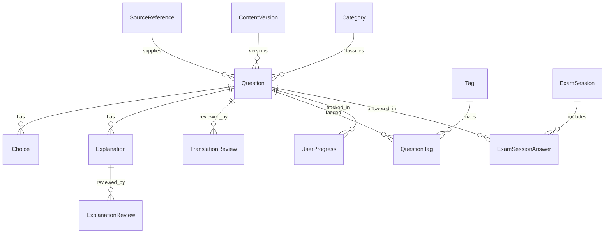

# 日本運転免許本試験 学習アプリ データスキーマ定義 v0.1

## 1. 目的

本ドキュメントは、以下を成立させるためのMVPデータモデルを定義する。

- 公式問題の参照元管理
- 日本語原文から英語問題への翻訳管理
- 参照元解説またはAI生成解説の管理
- レビュー済みコンテンツのみ公開する運用
- iPad Webアプリ上での演習、模試、誤答復習、進捗可視化

## 2. 設計方針

### 2.1 原則

- `参照元` `問題` `解説` `レビュー` `学習履歴` は分離する
- 公開中の表示内容は、必ず `レビュー済みの英語版` を参照する
- 参照元更新や法改正があっても、既存公開版を壊さずに新バージョンを作れるようにする
- 学習履歴はコンテンツ本体から独立して保持する

### 2.2 MVPでの前提

- UI言語と学習言語は `英語`
- 原文言語は `ja` または `en`
- 問題形式はまず `true_false` と `single_choice` をサポートする
- 学習履歴は `iPadブラウザ内保存` を前提とする

## 3. 全体構造



## 4. エンティティ一覧

| Entity | 役割 | MVP必須 |
| --- | --- | --- |
| `SourceReference` | 問題の参照元、取得情報、権利確認状態を持つ | Yes |
| `ContentVersion` | 公開版のまとまりを管理する | Yes |
| `Category` | 主要カテゴリを管理する | Yes |
| `Tag` | 補助タグを管理する | Yes |
| `Question` | 公開対象となる英語問題の中心レコード | Yes |
| `Choice` | 問題の選択肢を管理する | Yes |
| `Explanation` | 解説本文と生成元情報を管理する | Yes |
| `TranslationReview` | 翻訳レビュー結果を管理する | Yes |
| `ExplanationReview` | 解説レビュー結果を管理する | Yes |
| `QuestionTag` | 問題とタグの関連付け | Yes |
| `UserProgress` | 問題単位の学習集計 | Yes |
| `ExamSession` | 模試・演習セッションのまとまり | Yes |
| `ExamSessionAnswer` | セッション内の各解答履歴 | Yes |
| `GlossaryTerm` | 用語集・標識集の表示用データ | Yes |

## 5. 詳細定義

### 5.1 `SourceReference`

外部参照元を表す。MVPでは `問題単位` または `問題セット単位` のどちらでも保持できるようにする。

| Field | Type | Required | Notes |
| --- | --- | --- | --- |
| `id` | string | Yes | 例: `src_001` |
| `sourceName` | string | Yes | 参照元名 |
| `sourceType` | enum | Yes | `official_site`, `official_pdf`, `official_booklet`, `other` |
| `sourceUrl` | string | No | URLがある場合のみ |
| `publisher` | string | No | 公開主体 |
| `regionScope` | enum | Yes | `national`, `prefecture_specific` |
| `originalLanguage` | enum | Yes | `ja`, `en` |
| `fetchedAt` | datetime | Yes | 取得日時 |
| `snapshotPath` | string | No | ローカル保存パスやオブジェクトキー |
| `rightsStatus` | enum | Yes | `unchecked`, `review_required`, `approved`, `rejected` |
| `rightsNotes` | text | No | 利用条件メモ |
| `lastVerifiedAt` | datetime | No | 権利確認日時 |
| `createdAt` | datetime | Yes | 作成日時 |
| `updatedAt` | datetime | Yes | 更新日時 |

公開条件上のルール:

- `rightsStatus = approved` でなければ、その参照元に紐づく問題は `published` にできない

### 5.2 `ContentVersion`

公開バージョン管理用。法改正や問題差し替え時の追跡に使う。

| Field | Type | Required | Notes |
| --- | --- | --- | --- |
| `id` | string | Yes | 例: `cv_2026_03_01` |
| `label` | string | Yes | 例: `2026.03.1` |
| `status` | enum | Yes | `draft`, `active`, `superseded` |
| `effectiveFrom` | date | Yes | 適用開始日 |
| `effectiveTo` | date | No | 終了日 |
| `releaseNotes` | text | No | 変更内容 |
| `createdAt` | datetime | Yes | 作成日時 |

### 5.3 `Category`

主要学習カテゴリ。

| Field | Type | Required | Notes |
| --- | --- | --- | --- |
| `id` | string | Yes | 例: `cat_road_signs` |
| `slug` | string | Yes | URL/内部識別子 |
| `labelEn` | string | Yes | 英語表示名 |
| `descriptionEn` | text | No | 説明 |
| `displayOrder` | integer | Yes | 並び順 |
| `isActive` | boolean | Yes | 利用中か |

### 5.4 `Tag`

補助タグ。出題傾向分析や絞り込みに使う。

| Field | Type | Required | Notes |
| --- | --- | --- | --- |
| `id` | string | Yes | 例: `tag_crosswalk` |
| `slug` | string | Yes | 内部識別子 |
| `labelEn` | string | Yes | 表示名 |

### 5.5 `Question`

英語で出題される公開単位。原文、翻訳結果、公開状態を持つ中心エンティティ。

| Field | Type | Required | Notes |
| --- | --- | --- | --- |
| `id` | string | Yes | 例: `q_0001` |
| `sourceReferenceId` | string | Yes | `SourceReference.id` |
| `contentVersionId` | string | Yes | `ContentVersion.id` |
| `sourceQuestionRef` | string | No | 元ページ番号、設問番号など |
| `questionType` | enum | Yes | `true_false`, `single_choice` |
| `mainCategoryId` | string | Yes | `Category.id` |
| `difficulty` | enum | Yes | `easy`, `medium`, `hard` |
| `status` | enum | Yes | `draft`, `translation_review`, `explanation_review`, `ready`, `published`, `archived` |
| `originalStem` | text | Yes | 原文問題文 |
| `originalLanguage` | enum | Yes | `ja`, `en` |
| `englishStem` | text | Yes | 公開候補の英語問題文 |
| `correctChoiceKey` | string | Yes | `A`, `B`, `C`, `D`, `T`, `F` など |
| `hasImage` | boolean | Yes | 画像有無 |
| `imageAssetPath` | string | No | 画像パス |
| `imageAltTextEn` | text | No | 画像付き問題で必須。英語の代替テキスト |
| `imageCaptionEn` | text | No | 画像の補足説明や見方の英語キャプション |
| `explanationOrigin` | enum | Yes | `source`, `ai`, `manual` |
| `activeExplanationId` | string | No | 採用中の解説 |
| `translationReviewStatus` | enum | Yes | `pending`, `approved`, `changes_requested` |
| `explanationReviewStatus` | enum | Yes | `pending`, `approved`, `changes_requested` |
| `isExamEligible` | boolean | Yes | 模試出題対象か |
| `publishedAt` | datetime | No | 公開日時 |
| `createdAt` | datetime | Yes | 作成日時 |
| `updatedAt` | datetime | Yes | 更新日時 |

公開条件上のルール:

- `translationReviewStatus = approved`
- `explanationReviewStatus = approved`
- `activeExplanationId` が存在する
- 紐づく `SourceReference.rightsStatus = approved`
- `hasImage = true` の場合は `imageAssetPath` と `imageAltTextEn` を必須にする
- 条件を満たした上でのみ `status = published` に遷移できる

### 5.6 `Choice`

問題の選択肢。原文と英語版の両方を持てるようにする。

| Field | Type | Required | Notes |
| --- | --- | --- | --- |
| `id` | string | Yes | 例: `ch_0001_a` |
| `questionId` | string | Yes | `Question.id` |
| `choiceKey` | string | Yes | `A`, `B`, `C`, `D`, `T`, `F` |
| `displayOrder` | integer | Yes | 表示順 |
| `originalText` | text | No | 原文選択肢 |
| `englishText` | text | Yes | 英語選択肢 |
| `isCorrect` | boolean | Yes | 正答か |

補足:

- `true_false` の場合は `T` `F` の2件を持つ
- `single_choice` の場合は通常 `A` から `D` を想定する

### 5.7 `Explanation`

問題に紐づく英語解説。複数候補を持てるようにし、公開時は `activeExplanationId` を参照する。

| Field | Type | Required | Notes |
| --- | --- | --- | --- |
| `id` | string | Yes | 例: `exp_0001_v1` |
| `questionId` | string | Yes | `Question.id` |
| `origin` | enum | Yes | `source`, `ai`, `manual` |
| `bodyEn` | text | Yes | 英語解説本文 |
| `sourceDerived` | boolean | Yes | 参照元由来か |
| `aiModel` | string | No | AI生成時のみ |
| `aiPromptVersion` | string | No | AI生成時のみ |
| `createdBy` | string | Yes | 作成主体 |
| `createdAt` | datetime | Yes | 作成日時 |
| `updatedAt` | datetime | Yes | 更新日時 |

### 5.8 `TranslationReview`

問題文と選択肢の翻訳レビュー結果。

| Field | Type | Required | Notes |
| --- | --- | --- | --- |
| `id` | string | Yes | 例: `tr_0001_v1` |
| `questionId` | string | Yes | `Question.id` |
| `reviewer` | string | Yes | レビュー担当 |
| `status` | enum | Yes | `pending`, `approved`, `changes_requested` |
| `accuracyCheck` | boolean | Yes | 法的意味を維持しているか |
| `naturalnessCheck` | boolean | Yes | 自然な英語か |
| `notes` | text | No | 指摘事項 |
| `reviewedAt` | datetime | No | レビュー完了日時 |

### 5.9 `ExplanationReview`

解説のレビュー結果。

| Field | Type | Required | Notes |
| --- | --- | --- | --- |
| `id` | string | Yes | 例: `er_0001_v1` |
| `explanationId` | string | Yes | `Explanation.id` |
| `reviewer` | string | Yes | レビュー担当 |
| `status` | enum | Yes | `pending`, `approved`, `changes_requested` |
| `accuracyCheck` | boolean | Yes | 法規上の正確性確認 |
| `clarityCheck` | boolean | Yes | 英語として分かりやすいか |
| `notes` | text | No | 指摘事項 |
| `reviewedAt` | datetime | No | レビュー完了日時 |

### 5.10 `QuestionTag`

問題とタグの中間テーブル。

| Field | Type | Required | Notes |
| --- | --- | --- | --- |
| `questionId` | string | Yes | `Question.id` |
| `tagId` | string | Yes | `Tag.id` |

### 5.11 `UserProgress`

iPadブラウザ内に保持する問題単位の学習集計。`learnerId` はローカル生成する。

| Field | Type | Required | Notes |
| --- | --- | --- | --- |
| `learnerId` | string | Yes | 端末内識別子 |
| `questionId` | string | Yes | `Question.id` |
| `attemptsTotal` | integer | Yes | 総解答回数 |
| `correctTotal` | integer | Yes | 正答回数 |
| `incorrectTotal` | integer | Yes | 誤答回数 |
| `lastAnsweredAt` | datetime | Yes | 最終解答日時 |
| `firstAnsweredAt` | datetime | Yes | 初回解答日時 |
| `masteryLevel` | enum | Yes | `new`, `learning`, `needs_review`, `mastered` |
| `lastResult` | enum | Yes | `correct`, `incorrect` |

### 5.12 `ExamSession`

模試または連続演習のセッション。

| Field | Type | Required | Notes |
| --- | --- | --- | --- |
| `id` | string | Yes | 例: `exam_20260311_01` |
| `learnerId` | string | Yes | 端末内識別子 |
| `mode` | enum | Yes | `mock_exam`, `practice_set`, `mistakes_only` |
| `contentVersionId` | string | Yes | 出題時点の版 |
| `startedAt` | datetime | Yes | 開始日時 |
| `endedAt` | datetime | No | 終了日時 |
| `timeLimitSeconds` | integer | No | 模試時のみ |
| `questionCount` | integer | Yes | 出題数 |
| `correctCount` | integer | No | 正答数 |
| `scorePercent` | decimal | No | 正答率 |
| `passThresholdPercent` | decimal | No | 合格ライン |
| `result` | enum | Yes | `in_progress`, `pass`, `fail`, `abandoned` |

### 5.13 `ExamSessionAnswer`

セッション内の各問題の解答履歴。分析と復習生成の基礎データ。

| Field | Type | Required | Notes |
| --- | --- | --- | --- |
| `id` | string | Yes | 例: `exa_0001` |
| `examSessionId` | string | Yes | `ExamSession.id` |
| `questionId` | string | Yes | `Question.id` |
| `selectedChoiceKey` | string | Yes | ユーザー回答 |
| `isCorrect` | boolean | Yes | 正誤 |
| `answeredAt` | datetime | Yes | 解答日時 |
| `responseTimeMs` | integer | No | 回答時間 |

### 5.14 `GlossaryTerm`

用語集および標識集用データ。

| Field | Type | Required | Notes |
| --- | --- | --- | --- |
| `id` | string | Yes | 例: `gls_stop_sign` |
| `termEn` | string | Yes | 用語名 |
| `shortDefinitionEn` | text | Yes | 短い定義 |
| `longExplanationEn` | text | No | 詳細説明 |
| `relatedCategoryId` | string | No | `Category.id` |
| `sourceReferenceId` | string | No | 画像や用語の参照元。`SourceReference.id` |
| `imageAssetPath` | string | No | 標識画像 |
| `imageAltTextEn` | text | No | 画像がある場合の英語代替テキスト |
| `isTrafficSign` | boolean | Yes | 標識か |
| `trafficSignKind` | enum | No | `warning`, `prohibitory`, `mandatory`, `priority`, `supplemental`, `expressway`, `regulatory`, `other` |
| `displayOrder` | integer | Yes | 並び順 |

補足ルール:

- `isTrafficSign = true` の場合は `imageAssetPath` と `imageAltTextEn` を必須にする
- `imageAssetPath` を持つ場合、`sourceReferenceId` を持ち、参照元の権利状態を追跡できるようにする

## 6. ステータス遷移

### 6.1 `Question.status`

| Status | 意味 | 次に遷移できる状態 |
| --- | --- | --- |
| `draft` | 参照元取得直後、未整備 | `translation_review` |
| `translation_review` | 英訳レビュー中 | `draft`, `explanation_review` |
| `explanation_review` | 解説レビュー中 | `draft`, `ready` |
| `ready` | 公開準備完了 | `published`, `archived` |
| `published` | 利用者向け公開中 | `archived` |
| `archived` | 非公開化済み | `draft` |

### 6.2 レビュー状態

- `TranslationReview.status` と `Question.translationReviewStatus` は同期させる
- `ExplanationReview.status` と `Question.explanationReviewStatus` は同期させる
- 最新レビューが `changes_requested` の場合、その問題は `ready` 以上に進めない

## 7. JSONサンプル

### 7.1 `Question` と関連データ

```json
{
  "sourceReference": {
    "id": "src_001",
    "sourceName": "Tokyo Metropolitan Police sample questions",
    "sourceType": "official_site",
    "sourceUrl": "https://example.jp/license/sample-questions/1",
    "originalLanguage": "ja",
    "rightsStatus": "approved",
    "fetchedAt": "2026-03-11T09:00:00Z"
  },
  "question": {
    "id": "q_0001",
    "sourceReferenceId": "src_001",
    "contentVersionId": "cv_2026_03_01",
    "questionType": "true_false",
    "mainCategoryId": "cat_right_of_way",
    "difficulty": "easy",
    "status": "published",
    "originalStem": "交差点では右から来る車が優先です。",
    "originalLanguage": "ja",
    "englishStem": "At an intersection, a vehicle coming from the right has priority.",
    "correctChoiceKey": "T",
    "hasImage": false,
    "explanationOrigin": "ai",
    "activeExplanationId": "exp_0001_v1",
    "translationReviewStatus": "approved",
    "explanationReviewStatus": "approved",
    "isExamEligible": true
  },
  "choices": [
    {
      "id": "ch_0001_t",
      "questionId": "q_0001",
      "choiceKey": "T",
      "displayOrder": 1,
      "originalText": "正しい",
      "englishText": "True",
      "isCorrect": true
    },
    {
      "id": "ch_0001_f",
      "questionId": "q_0001",
      "choiceKey": "F",
      "displayOrder": 2,
      "originalText": "誤り",
      "englishText": "False",
      "isCorrect": false
    }
  ],
  "explanation": {
    "id": "exp_0001_v1",
    "questionId": "q_0001",
    "origin": "ai",
    "bodyEn": "This is correct because the default rule at an uncontrolled intersection is to yield to traffic approaching from your right, unless signs or markings indicate otherwise.",
    "sourceDerived": false,
    "aiModel": "gpt-5",
    "aiPromptVersion": "exp-v1"
  }
}
```

### 7.2 `UserProgress`

```json
{
  "learnerId": "local_7fa2",
  "questionId": "q_0001",
  "attemptsTotal": 3,
  "correctTotal": 2,
  "incorrectTotal": 1,
  "firstAnsweredAt": "2026-03-11T10:00:00Z",
  "lastAnsweredAt": "2026-03-11T10:20:00Z",
  "masteryLevel": "learning",
  "lastResult": "correct"
}
```

## 8. MVP実装への落とし込み

### 8.1 コンテンツ保存

MVPでは次の方針を推奨する。

- 問題マスタは `JSONファイル群` または `SQLite` で管理する
- 参照元とレビュー履歴を一緒に持てる形を優先する
- 手修正しやすい `フラットすぎるCSV` は避ける

### 8.2 学習履歴保存

MVPでは次の方針を推奨する。

- `IndexedDB` を第一候補とする
- `localStorage` は軽量設定値のみ
- サインイン導入後にクラウド同期へ拡張できるよう、`learnerId` を抽象化しておく

### 8.3 APIまたはアプリ内部で必要な読み出し単位

- ホーム画面用: `UserProgress` 集計 + 最近の `ExamSession`
- 問題出題用: `Question` + `Choice` + `active Explanation`
- 復習用: `incorrectTotal > 0` または `lastResult = incorrect`
- 模試用: `isExamEligible = true` かつ `status = published`

## 9. この後に設計すべきもの

1. `content ingestion` の運用フロー
2. `translation review` と `explanation review` の作業基準
3. iPad前提の `画面一覧` と `画面遷移`
4. 上記スキーマに対応する `初期サンプルデータ`

## 10. 重要な補足

このスキーマは `正しく公開できること` を優先している。  
`参照元の権利確認` と `レビュー済み公開` をデータ構造で強制しないと、後から運用で破綻する可能性が高い。
